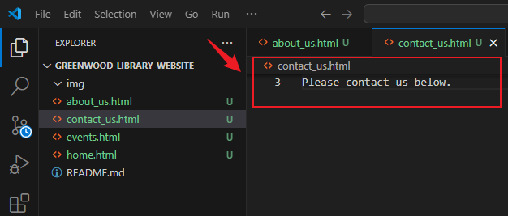
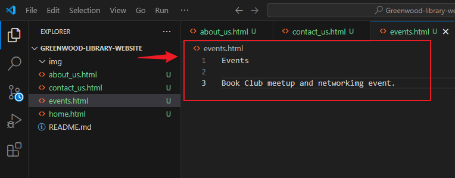
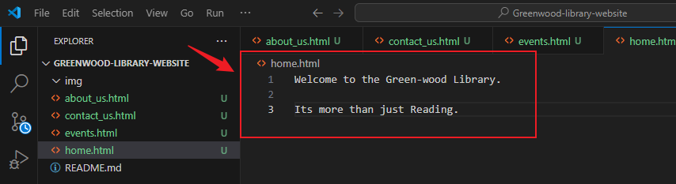
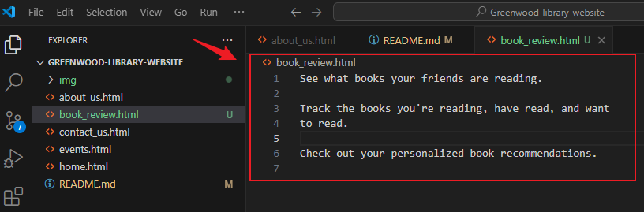

>## Greenwood-Library-Website Project Implementation.

#### `Create New Repository on Github.`
---

- In your web browser, open your Git hub account and create a new repository.

- Name the repository `Greenwood-library-website`.

- Click on the Add a `README.md file` and create repository.

#### `Cloning Your Repository`
---

- Click the code button and copy the HTTPS link.

- Open your local terminal and navigate into the directory where you want to clone your remote repository.

- Type in the command `git clone` and paste the link copied from your git hub.

- Change directory into the cloned repository.

> #### `File Manipulation`
---

- On your terminal, create `HTML` files.

- Using the Visual Studio Code editor, add contents to the`about_us.html` file.

- Add desired content into the `contact_us.html` file.

- Repeat the same process for the `event.html` file and the `home.html`file by adding contents to each file.

- `home.html`

`## STAGING, COMMITING AND PUSHING FILES`

- On the terminal, use `git status` command to know the current state of the repository.

- Stage files using the `git add .` command and check status again.

- Files in green indicate files are now staged and ready for commit.

- Use the `git commit` command to capture changes in the repository.

- The git commit command represents a "save version" of the project captured in time.

 - Use `git push` command to upload local repository content to a remote repository.

> ## `CREATING A BRANCH IN GIT`
#### `Adding Book Review`
- Create a branch using the `git checkout -b`command, followed by the branch name and switch to it.

- Create new file and name it `review.html`

- Add content to `review.html`, after which files should be staged, commited and pushed into the Git hub repository.

